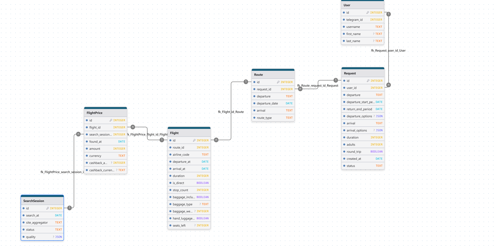

# SkyPrice AI: Advanced Flight Ticket Price Monitoring & Analytics Platform

## Overview

SkyPrice AI is an intelligent flight ticket monitoring system that collects historical price data and provides optimal purchase recommendations. The system automates the entire pipeline from data collection to actionable insights.

Overview presentation in Russian availaible here: [presentation](./presentations/Zadorozhnyi%20A.%20SkyPrice%20AI.pdf)

## Key Features

### 🎯 Smart Route Generation

- **Personalized Trip Configuration**: Users specify travel preferences including:
  - Date ranges and flexible travel windows
  - Departure/arrival day preferences
  - Round-trip or one-way options
  - Time of day preferences
  - Budget constraints (_Not implemented yet_)
- **Dynamic Route Creation**: System generates all possible route combinations based on user preferences and initiates data collection

### 📊 Data Collection & Processing Pipeline

- **Multi-Source Aggregation**: Currently supports Trip.com and Kypibilet with extensible architecture for additional aggregators
- **Real-time Scraping**: Uses Selenium for dynamic content extraction where APIs are unavailable
- **Historical Data Building**: Continuously collects and archives price data for trend analysis
- **Automated Scheduling**: Apache Airflow manages all data collection workflows

## Technology Stack ([Installation guide](#installation))

| Component | Technology | Purpose |
|-----------|------------|---------|
| **Orchestration** | Apache Airflow | Workflow scheduling and automation |
| **Data Storage** | PostgreSQL + SQLAlchemy | Processed/analyzed data storage |
| **Raw Data Storage** | S3/MinIO | Raw scraped data and archives |
| **Visualization** | Streamlit | Interactive dashboards and analytics |
| **Data Collection** | Selenium (Python) | Web scraping for real-time prices |
| **Data Processing** | Pandas, NumPy | Data cleaning and transformation |
| **Container Orchestration** | Docker Compose | Easy deployment and service management |

## System Architecture (Course requirements)

Screenshots can be founded at: [screenshot folder](./screenshots/). For example:

### 1. **Project Scope Definition**

- **Domain**: Travel & Transportation Optimization
- **Business Problem**: Reducing customer acquisition costs and improving purchase timing for flight tickets through predictive analytics
- **Objectives**:
  - Identify optimal purchase windows (when to buy)
  - Predict price fluctuations based on historical patterns (and possibility to view trends)
  - Provide data-driven recommendations for cost savings
  - Enable competitive analysis across multiple aggregators

### 2. **Data Collection** [Scrapers folder](./airflow/scrapers)

- **Data Sources**:
  - Primary: Trip.com, Kypibilet (web scraping via Selenium). Also have tested parsers for tbank and aviasales API (_Not integrated in system yet_)
  - Secondary: Historical price archives via Aviasales (_Not implemented yet_)
  - Metadata: Flight schedules, airline information, seasonal data (_Not implemented yet_)
- **Collection Methods**:
  - Automated browser-based scraping for real-time prices
  - Scheduled collection at multiple time intervals
  - Error handling and retry mechanisms for robustness

### 3. **Data Cleaning** (aka [Bronze layer](./airflow/bronze_layer/))

- **Error Detection**: Automated validation for missing prices, incorrect formats, and outlier detection
- **Data Quality Checks**:
  - Price sanity validation (minimum/maximum thresholds)
  - Date format standardization
  - Duplicate entry removal
  - Currency normalization and conversion
  - Saving DataQuality metrics on each session for future analytics (Already helps to increase data quality from 50 to 80%)
- **Tools**: Custom Python scripts with Pandas for data validation and correction

### 4. **Data Preprocessing** (aka [Bronze layer](./airflow/bronze_layer/))

- **Normalization/Standardization**:
  - Price normalization across different currencies
  - Time-based feature engineering (days to departure, weekday encoding)
  - Seasonal adjustment factors
- **Missing Value Handling**:
  - Interpolation for missing price points
  - Forward/backward filling where appropriate
  - Flagging of incomplete records
- **Categorical Encoding**:
  - One-hot encoding for airlines, airports
  - Cyclical encoding for time features
  - Route encoding for origin-destination pairs

Screenshots can be founded at: [screenshot folder: 3-5](./screenshots/). For example:

### 5. **Data Storage**

- **Storage Strategy**:
  - [**Raw Data**](./airflow/minio_utils/): S3/MinIO object storage for unprocessed scraped data
  - [**Processed Data**](./airflow/db/): PostgreSQL relational database for analytics-ready data
  - [**Analytical Data aka Silver and Golden layers**](./airflow/aggregation_layers/): Optimized tables for fast querying and reporting
- [**Database Schema**](./airflow/db/diagrams/TicketPriceMonitoringPG_2025-12-29T22_19_13.633Z.png):
  - Dimension tables: Requests, routes, search_sessions, flights and so on
  - Aggregated materizlized views: Daily summaries, trend calculations

Database scructure:
<p align="center">
      
</p>

### 6. [**Data Analysis & Visualization**](./visualization_app/visualizations.py)

- Streamlit:
  - Interactive price trend charts
  - Optimal purchase timing indicators
  - Route comparison tools
  - Historical performance analytics
  - Alert configuration interface

Screenshots can be founded at: [screenshot folder: 6-7](./screenshots/). For example:

<p align="center">
      
</p>

### 7. [**Data Quality Assurance**](./visualization_app/quality_visualizations.py)

- **Quality Metrics**:
  - Completeness: Percentage of successful data collection
  - Accuracy: Data parsing and processing metrics
  - Consistency: Cross-source validation
- **Automated Checks**:
  - Daily data quality reports
  - Collection success rate monitoring
  - Schema validation and drift detection

Screenshots can be founded at: [screenshot folder: 8-11](./screenshots/). For example:

<p align="center">
      
</p>

## Workflow Overview

```md
User Input → Route Generation → Data Collection → Storage → Processing → Analysis → Visualization → Alerts
```

## Extensibility

The platform is designed for easy extension:

- **New Aggregators**: Add additional flight data sources with standardized interfaces
- **Additional Analytics**: Integrate new machine learning models
- **Export Capabilities**: Extend data export options (CSV, PDF reports, API access)
- **Notification Channels**: Support for email, SMS, push notifications (_Not implemented yet_)

## Monitoring & Maintenance

- **Airflow Dashboard**: Monitor all data pipelines and collection jobs
- **Data Quality Reports**: Daily automated quality assessment (streamlit)
- **Performance Metrics**: Collection success rates, processing times

## Business Value

- **Cost Savings**: Identifies optimal purchase windows for maximum savings
- **Data-Driven Decisions**: Empirical analysis replaces guesswork
- **Competitive Intelligence**: Multi-aggregator comparison insights
- **Scalable Architecture**: Handles increasing data volumes and user loads

## [Installation](#installation)

### 1. Cloning a repository

```bash
git clone https://github.com/Alexander-Zadorozhnyy/flight-ticket-price-monitoring-tool.git
cd flight-ticket-price-monitoring-tool
```

### 2. Install docker (optional, if not already installed) - <https://docs.docker.com/engine/install/>

```bash
sudo apt remove $(dpkg --get-selections docker.io docker-compose docker-compose-v2 docker-doc podman-docker containerd runc | cut -f1)

# Add Docker's official GPG key:
sudo apt update
sudo apt install ca-certificates curl
sudo install -m 0755 -d /etc/apt/keyrings
sudo curl -fsSL https://download.docker.com/linux/ubuntu/gpg -o /etc/apt/keyrings/docker.asc
sudo chmod a+r /etc/apt/keyrings/docker.asc

# Add the repository to Apt sources:
sudo tee /etc/apt/sources.list.d/docker.sources <<EOF
Types: deb
URIs: https://download.docker.com/linux/ubuntu
Suites: $(. /etc/os-release && echo "${UBUNTU_CODENAME:-$VERSION_CODENAME}")
Components: stable
Signed-By: /etc/apt/keyrings/docker.asc
EOF

sudo apt update

sudo apt install docker-ce docker-ce-cli containerd.io docker-buildx-plugin docker-compose-plugin

# Check docker status
sudo systemctl status docker

# Verify that the installation is successful by running the hello-world image
sudo docker run hello-world
```

### Configure environment

#### Generate access and secrets for MinIO starage

1. Create folder `secrets` for storage keys and using after in docker compose

    ```bash
    mkdir secrets
    cd ./secrets
    ```

2. Generate random access key (20 characters)

    ```bash
    openssl rand -base64 15 | tr -d '/+=' | cut -c1-20 > minio_access_key.txt
    ```

3. Generate random secret key (40 characters)

    ```bash
    openssl rand -base64 30 | tr -d '/+=' | cut -c1-40 > minio_secret_key.txt
    ```

#### Create .env file

Create a `.env` file with structure similar to [`env.example`](./env.example) following variables:

```sh
AIRFLOW_UID=50000
AIRFLOW_PROJ_DIR=./airflow

POSTGRES_USER=airflow
POSTGRES_PASSWORD=airflow
POSTGRES_HOST=postgres
POSTGRES_PORT=5432
POSTGRES_DEFAULT_DATABASE=airflow
DB_NAME = price-monitoring

MINIO_ROOT_USER=minioadmin
MINIO_ROOT_PASSWORD=minioadmin
MINIO_ACCESS_KEY=your_access_key
MINIO_SECRET_KEY=your_secret_key
MINIO_SECURE=False
MINIO_ENDPOINT="minio:9000"
```

## Future plans

1. Add telegram bot for comfortable and user-friendly interface;
2. Add more site aggregators; Add telegram channels scraping for real-time updates;
3. Add user input request processing instead of raw sql interaction;
4. Add parallele data scraping; Solve issues with single chromium usage;
5. Add ml models for price trend prediction;
6. Add ml model for prediction best price period when user should buy tickets;
7. Add LLM for custom request handling
8. ...
